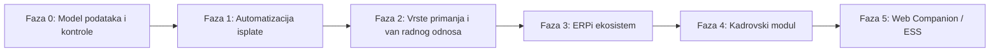

# 💼 ERPiZarade — Analiza Stanja, Gap Analiza i Razvojna Mapa

> Analiza podsistema **ERPiZarade** (WPF / .NET 8 / SQLite): šta sistem danas radi, gde zaostaje za savremenim cloud rešenjima za obračun zarada, i kojim redosledom to zatvoriti. Nalazi su provereni u kodu — gde je to bitno, navedena je konkretna datoteka i linija.

---

## 1. Rezime za Odlučivanje

| Pitanje | Odgovor |
| :--- | :--- |
| **Da li je osnova dobra?** | Da. Obračunski engine je tačan, brz i zakonski usklađen; periodični model podataka ispravno čuva istoriju. |
| **Šta je najveći rizik?** | Model podataka, ne funkcionalnosti. Struktura „jedan obračun po radniku po mesecu" i nepostojanje šifarnika vrsta primanja blokiraju veći deo planiranog razvoja. |
| **Šta prvo raditi?** | **Fazu 0** (dopuna modela, ~2 nedelje rada) — bez nje virmani, e-mail listići i PPP-PO nemaju odakle da povuku podatke. |
| **Šta odložiti?** | Web ESS portal. Zaštićen PDF poslat e-mailom donosi najveći deo iste vrednosti uz mali deo troška. |
| **Šta ne raditi uopšte?** | Dnevnice i putne troškove — već postoje u ERPiFinansije; treba ih preuzeti, ne računati iznova. |

---

## 2. Trenutno Stanje

### 2.1. Šta sistem radi dobro

* **Performanse i offline rad** — lokalna SQLite baza daje trenutan odziv i nezavisnost od mreže.
* **Periodični model podataka** — kombinacija `(BrojRadnika, Godina, Mesec)` u [`Radnik`](ERPiZaradeData/Models/Radnik.cs) osigurava da izmene koeficijenata, tekućih računa ili staža u tekućem mesecu ne narušavaju istorijske obračune.
* **Obračunski engine** — [`ObracunService`](ERPiZaradeApp/Services/ObracunService.cs) korektno pokriva minuli rad po čl. 108 (isključivo na osnovnu zaradu), prekovremeni, noćni, praznični i nedeljni rad, bolovanje po proseku, najnižu i najvišu osnovicu doprinosa, platne razrede i istorijske stope doprinosa po godinama.
* **Zakonska usklađenost (PPP-PD XML)** — direktna priprema XML fajla za Poresku upravu.
* **Štampa** — QuestPDF moduli za platne listiće, spiskove za isplatu, rekapitulacije i izveštaje po bankama.
* **Multi-tenancy za agencije** — izolovan rad sa više firmi kroz zasebne baze (`firma_{pib}_{naziv}.db`).

### 2.2. Gde su granice postojeće arhitekture

Ove tri stavke nisu „nedostajuće funkcije" nego osobine strukture koje ograničavaju sve što se na njih nadograđuje:

1. **Obračun je vezan za mesec, a ne za isplatu.** `ObracunPlate` postoji po paru `(Godina, Mesec)`, dok se PPP-PD podnosi **po pojedinačnoj isplati**.
2. **`ObracunPlate` je „široka" tabela sa ~60 kolona**, uglavnom direktnim portovima iz DBF-a (`NetoNerd`, `NetoGOd`, `KorDod1`, `DodatakNaM1`…). Svako novo primanje danas znači novu kolonu i novu migraciju.
3. **Vrste primanja ne postoje kao podatak.** SVP šifra se izvodi heuristikom iz teksta radnog mesta — vidi 4.1.

---

## 3. Uporedna Analiza sa Web/Cloud Rešenjima

Savremene aplikacije za obračun zarada pomerile su težište sa *kalkulatora plata* na **ekosistem upravljanja zaposlenima**:

| Funkcionalna Oblast | ERPiZarade (danas) | Savremena Web/Cloud rešenja |
| :--- | :--- | :--- |
| **Dostupnost i pristup** | Lokalno instalirana Windows aplikacija po računaru. | Pristup sa bilo kog uređaja (browser, mobilna aplikacija). |
| **Samoopslužni portal (ESS)** | Nema — zaposleni traže listiće od HR-a/knjigovođe. | Zaposleni sam preuzima listiće, traži odmor, proverava staž. |
| **Distribucija dokumenata** | Štampa u PDF ili na štampaču. | Automatski šifrovani e-mail, ESS portal, e-sanduče. |
| **Prošireni obračuni** | Redovna zarada iz radnog odnosa. | Ugovori o delu, PP poslovi, autorski ugovori, zakupi, porodiljska, RFZO bolovanja, nerezidenti. |
| **E-bankarstvo (virmani)** | Pregled/štampa naloga za prenos. | Izvoz ISO 20022 XML (Halcom, Asseco, Office Banking) za masovno slanje u banku. |
| **Digitalni HR** | Osnovni matični podaci radnika. | E-arhiva ugovora, automatska rešenja za odmor, eID/elektronski potpis. |
| **Integracija sa ERP-om** | Samostalan podsistem. | Automatsko knjiženje u glavnu knjigu, veza sa osnovnim sredstvima i SEF-om. |
| **Revizioni trag** | Nema evidencije ko je menjao obračun. | Pun audit log sa verzionisanjem i pravima pristupa. |

---

## 4. Gap Analiza

### 4.1. 🔴 Model podataka — blokatori (moraju se rešiti pre ostalog)

1. **Nema entiteta „isplata".**
   PPP-PD se podnosi po isplati, a model poznaje samo mesec. Zato nisu mogući: akontacija + konačna isplata, bonus/13. plata, dve isplate po različitim SVP šiframa u istom mesecu. Isti razlog blokira ugovore o delu — oni se ne vezuju za obračunski mesec.
   **Rešenje**: entitet `Isplata` (datum isplate, vrsta prijave, BOP, status) iznad stavki obračuna.

2. **Nema šifarnika vrsta primanja (SVP).**
   SVP se izvodi heuristikom u [`XmlExportService.cs:119-136`](ERPiZaradeApp/Services/XmlExportService.cs#L119-L136) — hardkodovano `101101000`, uz pravilo „ako je bolovanje veće od zarade → `109101000`", plus pokušaj čitanja devetocifrene šifre iz teksta polja `Radnik.Radno_Mesto`. Radi za redovnu zaradu jedne firme, pada na prvom novom tipu primanja.
   **Rešenje**: tabela `VrstaPrimanja` (SVP, oporezivo/neoporezivo, ulazak u osnovicu doprinosa, neoporezivi limit, konto za knjiženje) + tabela `ObracunStavka` (obračun, vrsta primanja, sati, iznos). Ovo je i preduslov za automatsko knjiženje iz 4.4.

3. **Nedostajuća polja koja predložene funkcije direktno traže:**

   | Funkcija | Nedostaje |
   | :--- | :--- |
   | E-mail platnih listića | `Radnik.Email` — **ne postoji u modelu** |
   | Virmani sa pozivom na broj | BOP i status PPP-PD prijave (podneta / prihvaćena / odbijena, datum) se nigde ne čuvaju |
   | Knjiženje po mestima troška | `Radnik` ima samo `BrojRadneJedinice`; ERPiFinansije već ima entitet `MestoTroska` — potreban je mapping |
   | Ispravno PPP-PD zaglavlje | `Firma` nema šifru opštine/sedišta — [`XmlExportService.cs:28-30`](ERPiZaradeApp/Services/XmlExportService.cs#L28-L30) koristi hardkodovane vrednosti `"079"`, `"010-123456"`, `"info@firma.rs"` |
   | Uplata rate kredita virmanom | `Kredit` nema primaoca (banku i račun) ni tip obustave |
   | Poreske olakšice | Nema oznake olakšice ni procenta povraćaja po radniku |

4. **Duplirani flag zaključavanja** — `Zakljucan` ([`ObracunPlate.cs:21`](ERPiZaradeData/Models/ObracunPlate.cs#L21)) i `Zakljucen` ([`:168`](ERPiZaradeData/Models/ObracunPlate.cs#L168)) postoje paralelno. Automatizacija isplate mora imati jedan izvor istine za „obračun se više ne sme menjati".

5. **Nema revizionog traga.** [`Korisnik`](ERPiZaradeData/Models/Korisnik.cs) ima uloge (Administrator/Operater/Gledalac), ali se ne beleži ko je kreirao, prekalkulisao, otključao ili obrisao obračun. ERPiFinansije već ima `NalogAudit` — isti obrazac treba primeniti ovde, gde je materijalna odgovornost veća.

### 4.2. Obračunske mogućnosti i vrste primanja

1. **Obračuni van radnog odnosa** — ugovori o delu (sa/bez socijalnog), autorski ugovori, privremeni i povremeni poslovi, naknade članovima upravnih i nadzornih odbora, dopunski rad, zakup nepokretnosti, dividende.
2. **Poreske olakšice za novozaposlene** — čl. 21ž ZPDG, kvalifikovano novozaposleno lice, olakšice za istraživanje i razvoj, osnivači u IT sektoru. U praksi najčešći razlog za ručnu intervenciju u obračunu.
3. **Bolovanja preko 30 dana (teret RFZO)** — posebna evidencija i obrasci za refundaciju (OZ-7, OZ-10).
4. **Neoporezivi iznosi kao parametar** — odvojen obračun neoporezivog i oporezivog dela prevoza (markica/gorivo), jubilarne nagrade, solidarne pomoći, pokloni deci, premije dobrovoljnog osiguranja. Zavisi od šifarnika iz 4.1.2.
5. **Minimalna zarada** — obračun po minimalnoj ceni rada × sati, doplata do minimalca i pregled ko je na minimalcu.
6. **Obustave** — zakonski limit (obustava ne sme preći 1/2 odnosno 1/3 neto zarade po Zakonu o izvršenju) **i redosled naplate** kada radnik ima više obustava (zakonsko izdržavanje ispred potrošačkih kredita).
7. **Storniranje i rekalkulacija zaključanog obračuna**, uz izmenjenu PPP-PD prijavu (vrsta 3/5). Dešava se svakog meseca, a trenutno nema podržan put.

### 4.3. Automatizacija, izvoz i kontrola

1. **Nalozi za prenos za e-bankarstvo (ISO 20022 XML / Halcom)** — nedostaje generator koji spaja isplate radnicima i zbirne uplate poreza i doprinosa sa pozivom na broj (BOP).
2. **E-mail distribucija zaštićenih platnih listića** — sa lozinkom po radniku i evidencijom slanja.
3. **Godišnji obrazac PPP-PO** — potvrda o plaćenim porezima i doprinosima po odbitku, koju je poslodavac dužan da uruči radniku do 31. januara.
4. **Kontrolne provere pre zaključavanja („pre-flight")** — neto manji od nule, bruto ispod minimalne osnovice, nevalidan JMBG ([`JmbgValidator`](ERPiZaradeApp/Services/JmbgValidator.cs) postoji, ali nije uklopljen u zbirni izveštaj), radnik bez tekućeg računa ili e-maila, sati veći od fonda. Mora se izvršiti **pre** slanja PPP-PD i virmana — ispravka posle podnošenja je skupa.
5. **Kalendar državnih praznika i automatski fond sati** — fond se danas prosleđuje kao parametar, a sati unose ručno.
6. **Uvoz radnih sati iz Excel/CSV** ili iz sistema za evidenciju prisustva — praktično veća ušteda vremena od ESS portala, uz nesrazmerno manji trošak.
7. **Analitika** — kretanje mase zarada kroz mesece, prosek po radnoj jedinici, poređenje dva obračuna („šta se promenilo u odnosu na prošli mesec"). Dashboard postoji kao osnova.

### 4.4. HR i kadrovska evidencija

1. **Praćenje ugovora i istorijat radnika** — datumi prijave/odjave na CROSO, vrsta ugovora (određeno/neodređeno), probni rad, istorija promena radnih mesta i zarada.
2. **Automatski obračun prava na godišnji odmor** — na osnovu staža, stručne spreme, uslova rada i broja dece; praćenje iskorišćenih i preostalih dana.
3. **Generator zakonskih akata** — rešenja o godišnjem odmoru, ugovori o radu, odluke o uvećanju zarade iz šablona.

### 4.5. Zaštita podataka o ličnosti

Slanje platnih listića e-mailom iznosi lične podatke (JMBG, zarada) iz kontrolisanog okruženja, pa uz tu funkciju idu i obaveze: **evidencija slanja** (kome, kada, na koju adresu), politika lozinke za PDF, i odluka o **enkripciji baze** — `plata.db` je danas običan SQLite fajl, čitljiv svakome sa pristupom računaru (opcija: SQLCipher). Ovo je obaveza po ZZPL, ne dodatna funkcija.

---

## 5. Razvojna Mapa

**Legenda procene**: **S** = do nedelju dana · **M** = 1–3 nedelje · **L** = 1–2 meseca · **XL** = kvartal i više.

### 🧱 Faza 0 — Preduslovi (procena: M)

| # | Stavka | Kriterijum „gotovo" |
| :--- | :--- | :--- |
| 0.1 | `Radnik.Email`, oznaka poreske olakšice, veza ka mestu troška | Polja u modelu, migracija primenjena, unos moguć iz kartona radnika |
| 0.2 | Podaci firme umesto hardkodovanih (opština, telefon, e-mail, SMTP) | `XmlExportService` nema nijednu literalnu vrednost firme |
| 0.3 | BOP i status PPP-PD prijave | Za svaku prijavu se čuva BOP, status i datum; vidljivo na ekranu PPP-PD |
| 0.4 | Objedinjavanje `Zakljucan`/`Zakljucen` | Jedno polje; zaključan obračun se ne može izmeniti ni iz jednog ekrana |
| 0.5 | Revizioni trag (obrazac `NalogAudit` iz ERPiFinansije) | Kreiranje, izmena, otključavanje i brisanje obračuna beleže korisnika i vreme |
| 0.6 | Pre-flight kontrolne provere | Jedan izveštaj pred zaključavanje; obračun sa greškama se ne može zaključati bez potvrde administratora |

### 🚀 Faza 1 — Automatizacija isplate (procena: M–L)

| # | Stavka | Kriterijum „gotovo" |
| :--- | :--- | :--- |
| 1.1 | Generator naloga za prenos (ISO 20022 XML / Halcom) | Fajl se učitava u bankarsku aplikaciju bez greške; zbir naloga jednak zbiru neto isplata iz obračuna; porezi i doprinosi nose ispravan BOP |
| 1.2 | E-mail servis za platne listiće (SMTP, PDF zaštićen lozinkom) | „Pošalji sve listiće" šalje svakom radniku njegov listić; svako slanje zabeleženo; radnici bez e-maila jasno prijavljeni |
| 1.3 | Godišnji PPP-PO i kartica radnika | Obrazac za izabranu godinu sadrži sve isplate i poreze po radniku i slaže se sa zbirom PPP-PD prijava |
| 1.4 | Kalendar praznika i automatski fond sati | Fond se računa iz kalendara; unos sati počinje od predpopunjenog punog radnog vremena |
| 1.5 | Uvoz radnih sati iz Excel/CSV | Fajl sa greškama se odbija sa spiskom redova; uspešan uvoz daje isti rezultat kao ručni unos |

### 📊 Faza 2 — Vrste primanja i obračuni van radnog odnosa (procena: L)

| # | Stavka | Kriterijum „gotovo" |
| :--- | :--- | :--- |
| 2.1 | Šifarnik `VrstaPrimanja` + `ObracunStavka` | Novo primanje se dodaje bez izmene šeme baze; postojeći obračuni daju identičan rezultat posle migracije |
| 2.2 | Entitet `Isplata` (više isplata u mesecu) | Akontacija i konačna isplata u istom mesecu daju dve ispravne PPP-PD prijave |
| 2.3 | Ugovori o delu, autorski, PP poslovi, naknade odborima | Obračun i PPP-PD sa ispravnom SVP šifrom za svaki tip |
| 2.4 | Poreske olakšice za novozaposlene | Olakšica se primenjuje po radniku i vidi se u obračunu i prijavi |
| 2.5 | Neoporezivi iznosi kao parametri (prevoz, jubilarne, solidarne pomoći, pokloni) | Prekoračenje neoporezivog limita automatski prelazi u oporezivi deo |
| 2.6 | Bolovanja preko 30 dana i obrasci za RFZO (OZ-7, OZ-10) | Obrazac se generiše iz podataka obračuna bez ručnog prepisivanja |
| 2.7 | Storniranje, rekalkulacija i izmenjena prijava (vrsta 3/5) | Storniran obračun ostaje u istoriji sa tragom ko ga je stornirao |

### 🔗 Faza 3 — Integracija sa ERPi ekosistemom (procena: M)

| # | Stavka | Kriterijum „gotovo" |
| :--- | :--- | :--- |
| 3.1 | Automatsko knjiženje u ERPiFinansije (konta 450, 451, 452, 570, 571…) | Nalog za knjiženje je u ravnoteži i podeljen po mestima troška iz entiteta `MestoTroska` |
| 3.2 | Preuzimanje oporezivog dela putnih naloga iz ERPiFinansije | Dnevnice se **ne unose dvaput** — ERPiZarade ih čita, ne računa |
| 3.3 | Zaduženja radnika iz ERPiSredstva | Karton radnika prikazuje zaduženu opremu (laptop, telefon, vozilo) |

### 📋 Faza 4 — Kadrovski modul (procena: L)

| # | Stavka | Kriterijum „gotovo" |
| :--- | :--- | :--- |
| 4.1 | Evidencija ugovora, CROSO prijava/odjava, istorijat radnih mesta i zarada | Za svakog radnika postoji hronologija bez rupa |
| 4.2 | Obračun prava na godišnji odmor (pun i srazmeran) | Broj dana se slaže sa ručnim obračunom po Zakonu o radu za kontrolni uzorak |
| 4.3 | Generator akata iz Word/PDF šablona | Rešenje o odmoru i ugovor o radu se generišu bez ručnog unosa podataka |

### 🌐 Faza 5 — Web Companion / ESS (procena: XL — **preispitati pre pokretanja**)

Portal za zaposlene i menadžere (ASP.NET Core API + Blazor/React), sa pregledom listića, zahtevima za odsustvo, odobravanjem i elektronskim potpisom.

> **Preporuka**: pokrenuti tek pošto Faza 1.2 (zaštićen PDF na e-mail) bude u produkciji i pokaže se da nije dovoljna. Ako se ide dalje, prvi korak nije ESS nego **zajednički ERPi identitet i API kroz ERPiHub** — inače se gradi drugi, nezavisan sistem naloga.

---

## 6. Otvorena Pitanja za Odluku

1. **Arhitektura za agencije.** Multi-tenancy kroz zasebne baze je u 2.1 naveden kao prednost, ali za agencije znači da se poreski parametri i šifarnici duplikuju u svakoj bazi i održavaju ručno, bez objedinjenog pregleda više firmi. Treba odlučiti: zajednička baza šifarnika, centralizovana distribucija parametara, ili status quo.
2. **Enkripcija baze** (SQLCipher ili ekvivalent) — odluka nosi trošak performansi i migracije, ali i pravnu izloženost ako se ne uradi.
3. **Legacy kolone u `ObracunPlate`.** Pri prelasku na model stavki (2.1) — prevesti ih sve, ili zamrznuti stare periode „kako jesu" i novi model primeniti od određenog datuma? Druga opcija je jeftinija, ali ostavlja dva puta kroz kod.
4. **Obim Faze 5** — pun ESS portal ili samo web pregled listića bez zahteva za odsustvo.

---

## 7. Zaključak

**ERPiZarade je stabilna, brza i zakonski tačna podloga za obračun zarada.** Da bi se izdigla na nivo tržišnih web rešenja, ne treba menjati WPF desktop engine, već ga nadograditi u hibridni model — ali **redosled je bitniji od obima**:

1. **Faza 0 nije opciona.** Virmani, e-mail listići i PPP-PO iz Faze 1 nemaju odakle da povuku podatke dok se model ne dopuni. Uloženo: nekoliko nedelja; ušteda: izbegnute prepravke već isporučenih funkcija.
2. **Faza 1 nosi najveći odnos vrednosti i troška.** Virmani, listići e-mailom, uvoz sati i automatski fond sati zajedno uklanjaju najveći deo mesečnog ručnog rada.
3. **Prelazak na model „vrsta primanja + stavke obračuna" (2.1) je najveći pojedinačni zahvat u planu**, ali je preduslov za sve obračune van radnog odnosa. Što se kasnije uradi, to je više legacy kolona koje treba prevesti.
4. **Web portal je poslednji, ne prvi korak** ka „cloud nivou" — a možda i nepotreban, ako zaštićeni PDF na e-mail zadovolji stvarnu potrebu zaposlenih.
