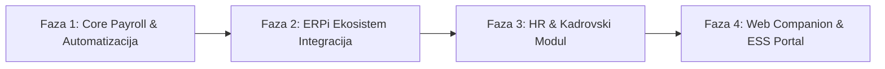

# 💼 ERPiZarade — Analiza Postojećih Funkcionalnosti, Tržišnih Standarda i Predlozi Unapređenja

> Sveobuhvatna analiza podsistema **ERPiZarade**, uporedni pregled sa savremenim web/cloud SaaS rešenjima za obračun zarada i HR, i definisana razvojna mapa novih funkcionalnosti.

---

## 1. Analiza Trenutnog Stanja ERPiZarade

Sistem **ERPiZarade** je trenutno postavljen kao moderni **WPF / .NET 8 / SQLite** desktop podsistem sa arhitekturom snimanja periodičnih stanja (mesečni snapshot radnika i obračuna).

### 💡 Ključne Prednosti Trenutnog Sistema:
* **Izuzetne performanse i offline rad**: Rad sa lokalnom SQLite bazom omogućava trenutan odziv, visoku pouzdanost i brzinu proračuna i pretraga.
* **Periodični model podataka**: Kombinacija `(BrojRadnika, Godina, Mesec)` osigurava da izmene koeficijenata, tekućih računa ili staža u tekućem mesecu ne narušavaju istorijske obračune.
* **Automatska zakonska usklađenost (PPP-PD XML)**: Podržana je direktna priprema XML fajla za Poresku upravu Srbije.
* **Štampa i izveštavanje**: Integrisan QuestPDF modul za generisanje platnih listića, spiskova za isplatu i rekapitulacija po radnim jedinicama.
* **Multi-tenancy za agencije**: Podrška za izolovan rad sa više firmi preimenovanjem baza (`firma_{pib}_{naziv}.db`).

---

## 2. Uporedna Analiza sa Web Aplikacijama za Obračun Zarada (SaaS Standardi)

Savremene web aplikacije za obračun zarada i ljudske resurse (HRM) pomerile su težište sa samog *kalkulatora plata* na **celokupan ekosistem upravljanja zaposlenima**:

| Funkcionalna Oblast | ERPiZarade (Trenutno Desktop) | Savremene Web/Cloud Aplikacije |
| :--- | :--- | :--- |
| **Dostupnost i Pristup** | Lokalno instalirana Windows aplikacija po računaru. | Cloud pristup sa bilo kog uređaja (Browser, Mobilna aplikacija). |
| **Samoopslužni Portal (ESS)** | Nema. Zaposleni traže papirne listiće od HR-a/Knjigovođe. | Zaposleni samostalno preuzimaju platne listiće, traže odmor i proveravaju dane staža. |
| **Distribucija Dokumenta** | Štampa u PDF ili na štampaču. | Automatski šifrovani E-mail, dostava na ESS portal ili E-sanduče. |
| **Prošireni Obračuni** | Obračun redovne plate (radni odnos). | Ugovori o delu, PP poslovi, autorski ugovori, zakupi, porodiljska, RFZO bolovanja, nerezidenti. |
| **E-Bankarstvo (Virmani)** | Štampa/pregled naloga za prenos na papiru. | Izvoz ISO 20022 XML (Halcom, Asseco, Office Banking) za masovno slanje u banku. |
| **Digitalni HR i Dokumentacija** | Evidencija osnovnih matičnih podataka radnika. | E-Arhiva ugovora, automatsko generisanje rešenja za odmor, eID/elektronski potpis. |
| **Integracija sa ERP-om** | Samostalan podsistem. | Automatsko knjiženje u Glavnu knjigu, integracija sa Osnovnim sredstvima i e-Fakturama (SEF). |

---

## 3. Šta u Postojećim Funkcionalnostima ERPiZarade Nedostaje (Gap Analiza)

### A. Obračunske Mogućnosti i Vrste Primanja
1. **Nedostatak Obračuna Van Radnog Odnosa**: Trenutni sistem je primarno fokusiran na redovne zarade zaposlenih. Nedostaju moduli za:
   - Ugovore o delu (sa/bez socijalnog osiguranja).
   - Autorske ugovore i Privremene/Povremene poslove (PP).
   - Naknade članovima upravnih i nadzornih odbora, ugovore o dopunskom radu.
   - Obračun zakupa nepokretnosti i dividendi.
2. **Bolovanja preko 30 Dana (Na teret RFZO)**:
   - Nedostaje posebna evidencija i generisanje zakonskih obrazaca (OZ-7, OZ-10) za refundaciju bolovanja od strane zdravstvenog osiguranja.
3. **Specifične Naknade i Neoporezivi Iznosi**:
   - Podrška za odvojeni obračun neoporezivog i oporezivog dela naknade za prevoz (Markica / Gorivo).
   - Terenski dodaci, dnevnice za službena putovanja (u zemlji i inostranstvu).
   - Jubilarne nagrade, solidarne pomoći, pokloni deci radnika, premije dobrovoljnog penzijskog/zdravstvenog osiguranja.
4. **Napredne Obustave i Limitiranje Kredita**:
   - Proračun zakonskih ograničenja obustava (npr. obustava ne sme preći 1/2 ili 1/3 neto plate prema Izvršnom zakonu).

### B. Automatizacija i Izvoz Podataka
1. **Nalozi za Prenos za E-Bankarstvo (ISO 20022 XML / Halcom)**:
   - Trenutno ne postoji direktan generator fajlova za elektronsko bankarstvo koji spaja isplate zarada radnicima i zbirne uplate poreza i doprinosa sa Pozivom na broj (BOP iz PPP-PD).
2. **E-mail Distribucija Zaštićenih Platnih Listića**:
   - Nemogućnost automatskog slanja PDF platnih listića radnicima na e-mail adresu (zaštićenih lozinkom sa npr. JMBG-om).
3. **Godišnji Obrazac PPP-PO**:
   - Nedostaje automatsko generisanje potvrdice o plaćenim porezima i doprinosima po odbitku (Obrazac PPP-PO) koji je poslodavac dužan da uruči radniku do 31. januara za prethodnu godinu.

### C. HR i Kadrovska Evidencija (Kadrovi)
1. **Praćenje Ugovora i Istorijat Radnika**:
   - Nedostaje evidencija datuma prijave/odjave na CROSO, vrsta ugovora (na određeno/neodređeno), probni rad, istorija promena radnih mesta i plata.
2. **Automatski Obračun Prava na Godišnji Odmor**:
   - Sistem nema algoritam koji na osnovu staža, stručne spreme, uslova rada i broja dece izračunava ukupan broj dana godišnjeg odmora i prati preostale dane.

---

## 4. Predlog Novih Funkcionalnosti i Razvojna Mapa (Roadmap)

### 🚀 Faza 1: Automatizacija i Proširenje Obračuna (Kratkoročne dopune)
1. **Generator E-Bankarskih Naloga (Halcom / ISO 20022 XML / Asseco)**:
   - Dodavanje modula koji iz svakog obračuna automatski generiše XML/TXT fajrove za isplatu plata na tekuće račune svih banaka, kao i naloge za uplatne račune poreza i doprinosa sa BOP-om.
2. **E-mail Servis za Platne Listiće**:
   - Integracija SMTP servisa u aplikaciju sa opcijom "Pošalji sve listiće e-mailom" gde se svaki PDF kriptuje lozinkom radnika.
3. **Prošireni Katalog Vrsta Primanja**:
   - Uvođenje parametarskih šifarnika za neoporezive iznose (prevoz, jubilarne nagrade, solidarna pomoć, pokloni).
4. **Godišnji PPP-PO i Kartica Radnika**:
   - Generisanje godišnjeg pregleda svih isplata i poreza po zaposlenom.

### 🔗 Faza 2: Integracija sa ERPi Ekosistemom
1. **Automatsko Knjiženje u ERPiFinansije**:
   - Kreiranje automatskog naloga za knjiženje zarada u finansijsko knjigovodstvo (Konta sintetike/analitike 450, 451, 452, 570, 571, itd.) podeljenog po mestima troška.
2. **Povezivanje Zaduženja sa ERPiSredstva**:
   - Uvid u kartonu radnika koje osnovno sredstvo/sitni inventar (laptop, telefon, vozilo) radnik trenutno zadužuje.

### 📋 Faza 3: Kadrovski Modul (DocGen Engine & CROSO)
1. **Generator Zakonskih Akata (Word/PDF Templates)**:
   - Automatsko kreiranje Rešenja o godišnjem odmoru, Ugovora o radu i Odluka o uvećanju zarade ubacivanjem podataka iz baze u gotove šablone.
2. **Evidencija Staža i Prava na Odmor**:
   - Modul za proračun srazmernog i punog godišnjeg odmora.

### 🌐 Faza 4: ERPiZarade Web Companion (Korisnički i Menadžerski Web Portal)
Za postizanje nivoa savremenih cloud rešenja, predlaže se dodavanje lakog **Web Companion** servisa (npr. ASP.NET Core API + Blazor / React):
1. **Portal za Zaposlene (Employee Self-Service - ESS)**:
   - Prijava putem mobilnog telefona ili browsera.
   - Pregled i preuzimanje sopstvenih platnih listića i PPP-PO potvrda.
   - Podnošenje digitalnog zahteva za godišnji odmor / bolovanje.
2. **Portal za Menadžere (Manager Self-Service - MSS)**:
   - Odobravanje ili odbijanje zahteva za odsustvo u par klikova.
   - Kalendarski pregled prisustva tima.
3. **Digitalni Potpis (eID / eCert)**:
   - Mogućnost da direktor elektronski potpiše rešenje o godišnjem odmoru, a radnik potvrditi prijem kroz portal.

---

## 5. Zaključak i Preporučeni Naredni Koraci

Trenutna aplikacija **ERPiZarade** predstavlja **izuzetno stabilnu, brzu i zakonski tačnu podlogu za obračun zarada**. Da bi se izdigla na nivo vodećih tržišnih i web rešenja, nije potrebno menjati brzi WPF desktop engine, već ga nadograditi u **hibridni model**:

1. **Prvi korak (Brzi dobitak)**: Implementacija **ISO 20022 XML naloga za prenos**, **slanja platnih listića na e-mail** i **PPP-PO obrasca**.
2. **Drugi korak (Ekosistem)**: Automatsko knjiženje u **ERPiFinansije**.
3. **Treći korak (Web nadogradnja)**: Razvoj minimalnog web companion portala za zaposlene koji komunicira sa centralnom bazom ili API-jem.
