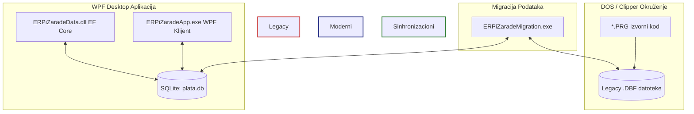
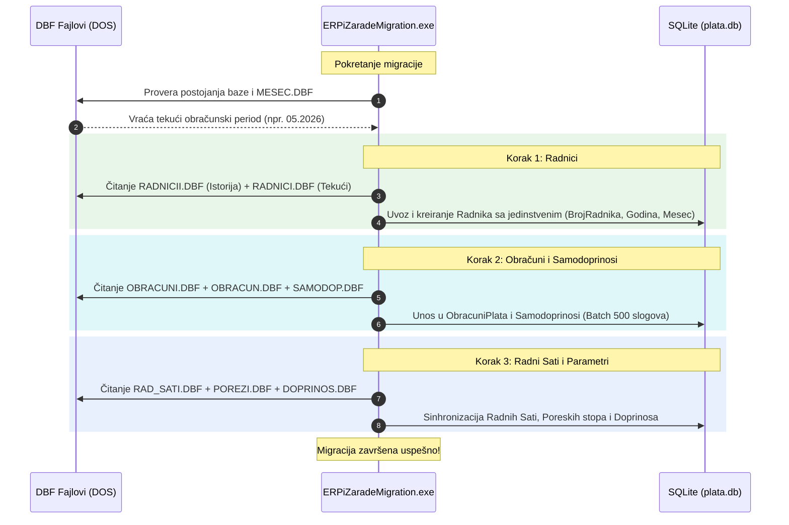
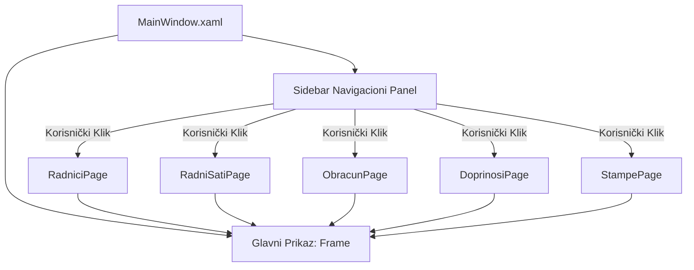

# Tehnička Dokumentacija Modernog .NET Podsistema (ERPiZarade)

Ovaj dokument pruža sveobuhvatan tehnički pregled modernog .NET podsistema za obračun zarada (**ERPiZarade**). Sistem je dizajniran da radi u simbiozi sa nasleđenim (legacy) Clipper/Harbour kodom (smeštenim u `PLATA` direktorijumu), omogućavajući prelazak na modernu desktop arhitekturu uz očuvanje stabilnosti i istorijskih kalkulacija.

---

## 1. Arhitektura Hibridnog Sistema

Sistem funkcioniše po hibridnom modelu koji povezuje DOS/Clipper aplikaciju i moderan .NET 8 WPF klijent sa SQLite bazom podataka.

### Periodična Arhitektura Podataka
Za razliku od standardnih migracionih sistema gde je radnik jedinstveni entitet u celoj bazi, ovaj sistem implementira **periodičnu (mesečnu) arhitekturu**:
- Jedan red u tabeli `Radnici` predstavlja zaposlenog **isključivo za jedan specifičan obračunski period** definisan kolonama `Godina` i `Mesec`.
- Unikatni ključ (Unique Index) na nivou baze je kombinacija: `(BrojRadnika, Godina, Mesec)`.
- Ovo omogućava da se istorijski koeficijenti, bankovni računi, minuli rad i status zaposlenog (aktivan/neaktivan) menjaju iz meseca u mesec bez narušavanja integriteta obračuna iz prošlih meseci.

---

## 2. Detaljan Pregled ERPiZaradeData sloja (EF Core + SQLite)

`ERPiZaradeData` je biblioteka klasa (Class Library) koja preko Entity Framework Core (EF Core) mapira SQLite bazu podataka `plata.db`.

### Ključni Entiteti i Tabele

#### 1. Radnik (`Table("Radnici")`)
Predstavlja port tabela `RADNICII.DBF` (istorija) i `RADNICI.DBF` (aktivni period).
- `Id` (int, PK): Auto-generisani primarni ključ u SQLite-u.
- `BrojRadnika` (int): Identifikator radnika prenesen iz Clipper-ovog polja `RED_BROJ` (ostaje isti kroz sve mesece).
- `Godina` i `Mesec` (int): Definišu obračunski period.
- `ImeIPrezime` (string, max 60).
- `Jmbg` (string, max 13) i `MaticniBroj` (string, max 20).
- `Koeficijent` i `Koeficijent1` (decimal 10,4): Ključni parametri za obračun plate.
- `MinuliRadGodine` (int): Broj godina radnog staža za obračun minulog rada.
- `BankovniRacun` (string) i `NazivBanke` (string).
- `Aktivan` (bool): Označava da li je radnik aktivan u tekućem mesecu.

#### 2. ObracunPlate (`Table("ObracuniPlata")`)
Glavna tabela za skladištenje rezultata obračuna. Port za `OBRACUN.DBF` (tekući) i `OBRACUNI.DBF` (istorijski obračuni).

| Grupa Parametara | Naziv Kolone u C# | Opis i Poreklo (DBF) |
| :--- | :--- | :--- |
| **Identifikacija** | `RadnikId`, `Godina`, `Mesec` | Poveznica sa tabelom `Radnici` za dati mesec. |
| **Bruto Zarada** | `BrutoZarada`, `BrutoBolovanje`, `BrutoNaknade`, `BrutoStimulacija`, `BrutoMinuliRad` | Bruto iznosi po različitim osnovama rada. |
| **Sati Rada** | `RedovniSati`, `BolovanjeSati`, `PrekovremeneSati`, `GodisnjioOdmorSati`, `DrzavniPraznikSati`, `NocniSati`, `SmenskiSati` | Sati rada preneseni iz evidencije časova. |
| **Doprinosi (Radnik)** | `DoprinosPioRadnik`, `DoprinosZdravstvoRadnik`, `DoprinosNezaposlenostRadnik` | Doprinosi na teret zaposlenog (ukupno 19.9% - PIO 14%, Zdravstvo 5.15%, Nezaposlenost 0.75%). |
| **Doprinosi (Poslodavac)**| `DoprinosPioPoslodavac`, `DoprinosZdravstvoPoslodavac`, `DoprinosNezaposlenostPoslodavac`| Doprinosi na teret poslodavca. |
| **Porezi** | `PorezNaDohodak`, `PoreskaOsnovica`, `LicniOdbitak` | Poreske kalkulacije (polje `LicniOdbitak` odgovara Clipper polju `umanjenje`). |
| **Obustave** | `KreditObustava`, `Samodoprinosi`, `OstaliOdbici` | Krediti radnika i lokalni samodoprinosi. |
| **Neto** | `NetoIsplata` | Neto iznos za isplatu zaposlenom (polje `ZA_ISPLATU` / `NETO`). |

#### 3. Doprinosi (`Table("Doprinosi")`)
Port za `DOPRINOS.DBF` i `DOPRINOI.DBF`. Čuva zakonske stope doprinosa i sistemske žiro-račune za uplatu.
- `ProcRadn` (decimal): Procenat na teret radnika.
- `ProcPosl` (decimal): Procenat na teret poslodavca.
- `NajnizaOsnovica` (decimal): Najniža dozvoljena bruto osnovica za obračun doprinosa.
- `NajvisaOsnovica` (decimal): Najviša osnovica za doprinose.

#### 4. Porezi (`Table("Porezi")`)
Port za `POREZI.DBF`. Sadrži poreske stope, pragove poreskog oslobođenja i procente uvećanja zarade.
- `Zarada` (decimal): Garantovana (minimalna) zarada.
- `AkPorez` (decimal): Primarna poreska stopa (standardno 10%).
- `Prvast` (decimal): Poresko oslobođenje (neoporezivi iznos).
- `ProcDrzav`, `ProcNocni`, `ProcPreko`, `ProcMinul` (decimal): Procenti uvećanja za otežane uslove rada (npr. prekovremeni rad standardno 26%, minuli rad 0.4% po godini staža).
- `TopliObrokCena` (decimal): Dnevna naknada za topli obrok.

#### 5. DoprinosiPoslodavca (`Table("DoprinosiPoslodavca")`)
Port za detaljnu rekapitulaciju poslodavca (`POSL_OBR.DBF` i `POSLOBRI.DBF`). Sadrži matrice od 9 mogućih tipova doprinosa za osnove: `Zar1..Zar9`, `Bol1..Bol9`, `Nak1..Nak9`, `Nep1..Nep9`, `B60F1..B60F9`, `B601..B609`, `Inv1..Inv9`, `Por1..Por9`.

---

## 3. Detaljan Pregled ERPiZaradeMigration sloja

`ERPiZaradeMigration` je visokooptimizovana konzolna aplikacija koja vrši prenos podataka iz DBF datoteka u SQLite bazu. Aplikacija se oslanja na paket `DbfDataReader` sa kodnom stranicom `cp852` (OEM Latin 2) kako bi se ispravno sačuvala naša slova (`Š`, `Đ`, `Č`, `Ć`, `Ž`).

### Ključne Karakteristike Migratora:
1. **Robusno Učitavanje Polja**: Koristi fleksibilne helper metode (`GetString`, `GetInt`, `GetDecimal`) koji pretražuju više alternativnih naziva kolona u DBF-u (npr. za JMBG pretražuje kolone `JMBG`, `MAT_BROJ`, `MAT_BR`).
2. **Batch Transakcije**: Podaci se upisuju u SQLite u paketima (Batches) od 500 slogova. Ukoliko dođe do greške, transakcija se poništava i preduzimaju se mere oporavka kako bi se izbeglo delimično upisivanje.
3. **Automatsko Mapiranje Samodoprinosa**: Združuje podatke iz `SAMODOP.DBF` i `SAMODOPI.DBF` sa kolonama `SAMODOP1..4` i `KR_IZ1..5` iz obračuna, pretvarajući ih u čitljive stavke u tabeli `Samodoprinosi` sa tekstualnim nazivom obustave (katalog).

---

## 4. Detaljan Pregled ERPiZaradeApp sloja (WPF Aplikacija)

`ERPiZaradeApp` je WPF desktop aplikacija izgrađena po uzoru na moderne standarde vizuelnog dizajna (sleek dark/light modovi, zaobljene ivice, harmonizovane palete boja bazirane na Indigo i Blue nijansama).

### Navigacija i MainWindow
Glavni prozor aplikacije koristi Sidebar sa navigacionim dugmićima koji učitavaju WPF stranice (`Page`) unutar centralnog `Frame` elementa:

### Podržani Ekran i Funkcionalnosti (Prikaz po sekcijama)
- **EVIDENCIJA**:
  - `Radnici`: Pregled i ažuriranje baze zaposlenih za tekući mesec.
  - `Radni sati`: Unos časova rada (redovni, bolovanja, praznici, prekovremeni, smenski sati, topli obrok dani).
  - `Obračun plate`: Pokretanje obračuna, pregled bruto, doprinosa, poreza i neto isplate u realnom vremenu.
  - `Porezi i parametri`: Upravljanje stopama poreza, vrednošću boda, neoporezivim delom i cenom toplog obroka.
  - `Doprinosi`: Zakonske stope doprinosa (PIO, zdravstveno osiguranje, nezaposlenost) za radnika i poslodavca sa žiro-računima.
  - `Platni razredi`: Definisanje fiksnih platnih razreda za sistematizaciju radnih mesta.
- **ŠTAMPA I IZVEŠTAJI**:
  - `Platni listići`: Generisanje i štampa mesečnih platnih listića (obračunski list) za zaposlene.
  - `Izveštaji & rekapitulacije`: Zbirne rekapitacije, kaskadni izveštaji i statistika po radnim jedinicama.
  - `PPP-PD`: Priprema i izvoz XML fajla za poresku prijavu PPP-PD direktno u sistem poreske uprave.
- **ŠIFARNICI I PARAMETRI**:
  - `Krediti`: Upravljanje obustavama i administrativnim zabranama.
  - `Banke`: Katalog banaka preko kojih se vrši isplata plata.
  - `Firme`: Podaci o preduzeću (PIB, MB, žiro račun).

---

## 5. Dinamički Multi-Tenant Sistem

Jedna od najnaprednijih funkcionalnosti podsistema je podrška za rad sa više firmi (Multi-Tenancy) preko izolovanih SQLite baza podataka.

Aplikacija to rešava na sledeći način u klasi `AppConfig`:
1. Kada se aplikacija pokrene, ona proverava prisustvo baze pod nazivom `plata_zajednicka.db` u direktorijumu `C:\ERPiZaradeApp\Baze\`.
2. Ukoliko baza postoji, privremeno je otvara i čita podatke o firmi iz tabele `Firme`.
3. Na osnovu pročitanog **PIB-a** i očišćenog **naziva firme**, aplikacija automatski preimenuje bazu u format:
   `firma_{pib}_{nazivClean}.db`
4. Putanja do preimenovane baze se automatski upisuje u korisnički profil (`settings.json`), čime se obezbeđuje brz prelazak i rad sa bazom tačno određene firme.

Ovim postupkom se sprečava prepisivanje podataka i omogućava knjigovodstvenim agencijama potpuno bezbedno vođenje obračuna zarada za neograničen broj firmi.

---

> [!NOTE]
> Baza podataka je indeksirana na svim kritičnim kolonama pretrage (JMBG, BrojRadnika, period Godina/Mesec), čime je postignuta brzina učitavanja izveštaja od preko 10x u odnosu na stare DBF indekse.

> [!TIP]
> Prilikom pokretanja migracije, konzola pruža bezbednosno pitanje o brisanju baze, čime se omogućava potpuno čisto učitavanje istorije ukoliko dođe do promena u shemama legacy koda.
